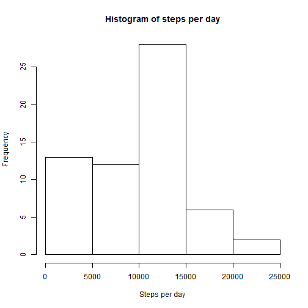
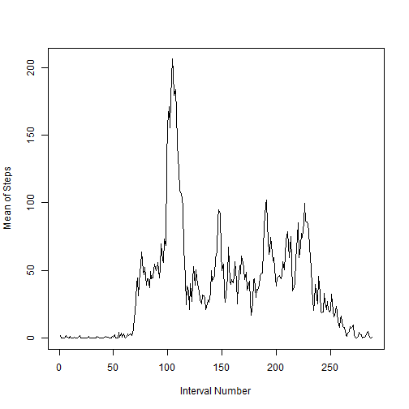
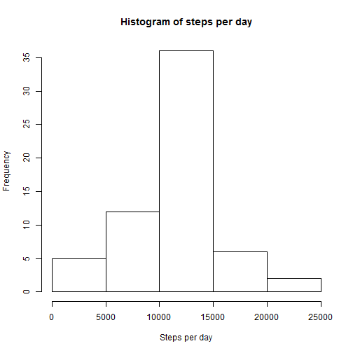
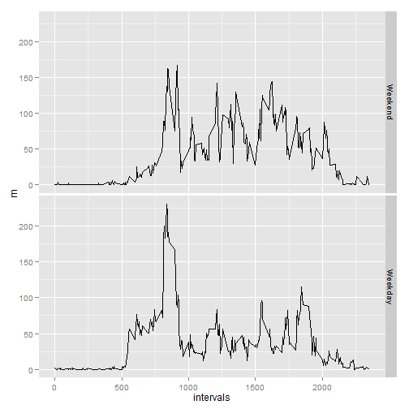

# Reproducible Research: Peer Assessment 1

## Loading and preprocessing the data

```r
data <- read.csv("activity.csv",stringsAsFactors = FALSE)
data <- transform(data,date = as.Date(date))
```

## What is mean total number of steps taken per day?

```r
date <- as.factor(data$date)
arr <- tapply(data$steps,date,sum,na.rm = TRUE)
hist(arr,xlab = "Steps per day", main = "Histogram of steps per day")
```

 

```r
mean <- mean(arr)
median <- median(arr)
```
The mean of the data is 9354.2295 and the median is 10395

## What is the average daily activity pattern?

```r
interval_list <- tapply(data$steps,factor(data$interval),mean,na.rm = TRUE)
plot(interval_list,type = "l",xlab = "Interval Number", ylab = "Mean of Steps")
```

 

```r
maxIndex <- names(which.max(interval_list))
```
Interval having the Maximxum steps on average over all days is 835

## Imputing missing values

For this I am filling in missing values with mean of interval

```r
list <- split(data$steps,factor(data$interval),drop = TRUE)
list <- lapply(list,mean,na.rm = TRUE)
missing_values <- is.na(data$steps)
number_missing <- sum(missing_values)
cat("Number of missing value = ", number_missing)
```

```
## Number of missing value =  2304
```

```r
for (i in 1:length(data$steps)){
  if(is.na(data$steps[i])) data[i,1] = list[[as.character(data[i,3])]]
}
arr_new <- tapply(data$steps,date,sum,na.rm = TRUE)
hist(arr_new,xlab = "Steps per day", main = "Histogram of steps per day")
```

 

```r
mean_new <- mean(arr_new)
median_new <- median(arr_new)
```
The mean of the new data is 1.0766 &times; 10<sup>4</sup> and the median is 1.0766 &times; 10<sup>4</sup>

We can see that by replacing the NA values by average of that interval, the mean and the median have increased but mainly due to the elimination of 0 values in the sum. We can see that clearly in the histogram(0 to 5000 bin has fallen by a considerable amount than the previous one.)

## Are there differences in activity patterns between weekdays and weekends?

```r
day_vec <- weekdays(data$date)
index = (day_vec == "Saturday"|day_vec == "Sunday")
weekend = 0
weekend[index] <- "Yes"
weekend[!index] <- "No"
weekend <- factor(weekend)
weekend_list <- split(data,weekend)
interval_list = list()
df <- weekend_list[["Yes"]]
list1 <- split(df$steps,df$interval)
df <- weekend_list[["No"]]
list2 <- split(df$steps,df$interval)
interval_list <- c(list1,list2)
m <- sapply(interval_list,mean)
x <- factor(c(rep(1,288),rep(0,288)))
levels(x) = c("Weekend","Weekday")
intervals = rep(unique(data$interval),2)
library(ggplot2)
qplot(intervals,m,facets = x~.,geom = "line")
```

 


